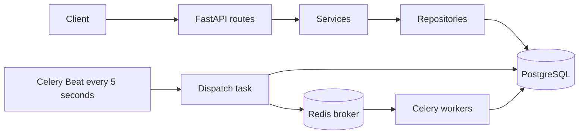

# Task Service

An asynchronous FastAPI backend implementing accounts, revocable JWT sessions, and durable background text reports. Python 3.11+, PostgreSQL, SQLAlchemy 2, Redis, Celery, Alembic, Docker, and GitHub Actions.

## Run with Docker

1. Copy `.env.example` to `.env`.
2. Generate a signing secret with `python -c "import secrets; print(secrets.token_urlsafe(48))"` and set `JWT_SECRET`. Set `POSTGRES_PASSWORD` to a random URL-safe value.
3. Start Docker Engine, then run:

```sh
docker compose up --build -d --wait
python scripts/smoke.py
```

Open [Swagger UI](http://localhost:8000/docs). Register and log in through the JSON endpoints, then paste the access token into **Authorize**. The API binds to localhost port 8000. PostgreSQL and Redis remain on the private Compose network. Migrations finish before API and workers start.

```sh
docker compose logs -f api worker beat
docker compose down
```

`down` retains data volumes. Only use `down -v` for disposable data.

## API

| Method | Path | Purpose |
| --- | --- | --- |
| POST | `/api/v1/auth/register` | Register with email and password |
| POST | `/api/v1/auth/login` | Issue access/refresh tokens |
| POST | `/api/v1/auth/refresh` | Rotate refresh token |
| POST | `/api/v1/auth/logout` | Revoke current login session |
| GET | `/api/v1/users/me` | Current user |
| POST | `/api/v1/jobs` | Queue a text report; requires `Idempotency-Key` |
| GET | `/api/v1/jobs` | List own jobs; bounded `limit` and `offset` |
| GET | `/api/v1/jobs/{id}` | Read own report status/result |
| GET | `/health/live` | Process liveness |
| GET | `/health/ready` | PostgreSQL and Redis connectivity |

Example registration/login body:

```json
{"email": "alice@example.com", "password": "a-long-unique-password"}
```

Example job request (send `Authorization: Bearer <access_token>` and `Idempotency-Key: report-001`):

```json
{"text": "hello hello world"}
```

The API returns HTTP 202 and a job ID. Poll that job for `completed` with word count, character count, unique words, and the ten most common words. The report is a bounded example workload; substitute your domain logic in `app/worker.py`.

## Architecture and delivery guarantees

`app/api.py` validates HTTP input and applies authorization. `services.py` owns workflows and transaction boundaries. `repositories.py` owns reusable queries. `models.py` maps PostgreSQL tables. `schemas.py` defines API contracts. Each request gets an independent async SQLAlchemy session. Bcrypt runs in a thread pool rather than blocking the event loop.



The job row doubles as durable dispatch intent. Beat repeatedly discovers up to 100 oldest queued jobs, so a failed broker publish or worker crash does not orphan a committed request. Delivery is at least once. PostgreSQL row locks and one result transaction make repeat report execution safe. No external effect is performed by the example job. External payments, email, or uploads need their own idempotency and recovery design. Only one Beat instance should run.

This simple dispatcher is for modest workloads: queued rows may be published repeatedly until completion, and permanently failing jobs remain queued for operator investigation. At scale, add dispatch leases, fair batching, dead-letter handling, queue-age alerts, and bounded admission. The sample holds a row lock during its bounded computation; do not hold database transactions through long external calls. Readiness checks dependency connectivity, not worker progress; monitor pending-job age and worker health separately.

## Authentication and security behavior

- HS256 JWTs validate algorithm, issuer, audience, type, expiry, and required claims. Signing secrets have no fallback and must be at least 32 characters; use randomly generated secrets.
- Access tokens expire after 15 minutes; refresh sessions have an absolute seven-day lifetime. Rotation stores only a SHA-256 digest of the current refresh token. Reusing an old signed refresh token revokes that login session, including its access tokens. Clients must serialize refresh calls and store replacement tokens atomically.
- Logout immediately revokes the current session. Access checks consult PostgreSQL, so this is deliberately stateful JWT authentication.
- Passwords require 12 characters and are limited to 72 UTF-8 bytes to avoid bcrypt truncation. Default bcrypt cost is 12. `BCRYPT_ROUNDS=4` is for tests only.
- Redis enforces an atomic per-peer auth limit (20 attempts/minute); auth fails closed if Redis is unavailable. Put a trusted reverse proxy with request-size, timeout, global and per-account limits in front of the service. Uvicorn proxy-header trust is disabled by default. Configure an explicit proxy IP allowlist before using forwarded client addresses.
- Validation errors omit submitted values; application responses never include password hashes. Requests get a generated correlation ID and structured access logs. Logs omit query strings, bodies, and authorization headers. Application exceptions include server-side tracebacks; restrict log access and retention.
- Jobs enforce owner isolation and per-owner idempotency; reusing a key with different content returns 409. There is no wildcard CORS policy. Production disables Swagger UI.

This project provides production-oriented foundations, not a claim that a deployment has passed a security audit. Email verification, password reset, MFA, tenant-specific quotas, retention, and account deletion are outside the sample's scope.

## Develop and test

```sh
python -m venv .venv
# Linux/macOS: source .venv/bin/activate
# PowerShell: .venv\Scripts\Activate.ps1
pip install -r requirements-dev.lock
pip install --no-deps -e .
pytest -q
ruff check .
ruff format --check .
```

Runtime and development dependencies are pinned separately in `requirements.lock` and `requirements-dev.lock`, including platform markers for Linux and Windows. Refresh them intentionally with `uv pip compile pyproject.toml --universal --python-version 3.11 -o requirements.lock` and the same command with `--extra dev -o requirements-dev.lock`, then rerun verification. Base image tags and GitHub Action major versions should be reviewed and pinned to approved digests/commits for your release policy.

Tests default to isolated temporary SQLite databases, mock the Redis rate limiter, and run real password/JWT and worker report code. PostgreSQL-only race tests skip locally unless `TEST_DATABASE_URL` points at a **disposable test database**; the fixture drops and recreates application tables. Never set it to a production database. CI runs the suite against PostgreSQL, checks migration upgrade/downgrade/schema drift, then runs a real Docker API/Beat/Redis/worker smoke test.

To run outside Docker, provide reachable PostgreSQL and Redis URLs in `.env`, run `alembic upgrade head`, then launch each process separately:

```sh
uvicorn app.main:app --reload
celery -A app.worker.celery_app worker --loglevel=INFO
celery -A app.worker.celery_app beat --loglevel=INFO
```

Use Linux containers for Celery on Windows. Do not use reload in production. Create migrations with `alembic revision --autogenerate -m "description"`, inspect them, and commit them. Never use ORM `create_all` as a production migration strategy.

## CI/CD and deployment

Place this directory at the root of a GitHub repository. `.github/workflows/ci.yml` tests pushes/PRs, then publishes `ghcr.io/<owner>/<repo>:<commit-sha>` after a successful push to `main`. PRs cannot publish. `.github/workflows/deploy.yml` is a manually triggered deployment that verifies successful main-branch CI for the supplied full commit SHA.

Prepare a Linux host with Docker Compose, `/opt/task-service/.env`, registry pull credentials if the GHCR image is private, and a deployment user able to manage Docker. Configure the GitHub `production` environment with variables `DEPLOY_HOST`, `DEPLOY_USER`, and secrets `DEPLOY_SSH_KEY`, `DEPLOY_KNOWN_HOSTS` (verified host key, not an unchecked runtime scan). Enable environment approvals and branch protection. The workflow copies Compose, pulls the tested image, migrates, restarts services, and waits for health checks. No cloud resources or GitHub settings are provisioned by these files.

Before public use, set `ENVIRONMENT=production`, configure TLS at a reverse proxy, secret storage and rotation, resource limits, dependency/image vulnerability scanning, metrics/alerts, database backups and restore drills, Redis access controls, and an appropriate data-retention policy. This Compose topology is a single-host deployment, without high availability or zero-downtime rollouts. Its database password must be URL-safe because Compose interpolates it into the connection URL.

Take a backup before migrations. Prefer backward-compatible expand/contract schema changes. To roll back application code, redeploy a previously successful commit SHA; migrations are not automatically reversed. A failed deployment may leave the new schema installed and requires investigation. Periodically remove expired/revoked login sessions and old job payloads according to your retention requirements.

## Implementation references

- [FastAPI JWT authentication](https://fastapi.tiangolo.com/tutorial/security/oauth2-jwt/)
- [SQLAlchemy asynchronous sessions](https://docs.sqlalchemy.org/en/20/orm/extensions/asyncio.html)
- [Celery task delivery and retries](https://docs.celeryq.dev/en/latest/userguide/tasks.html)
